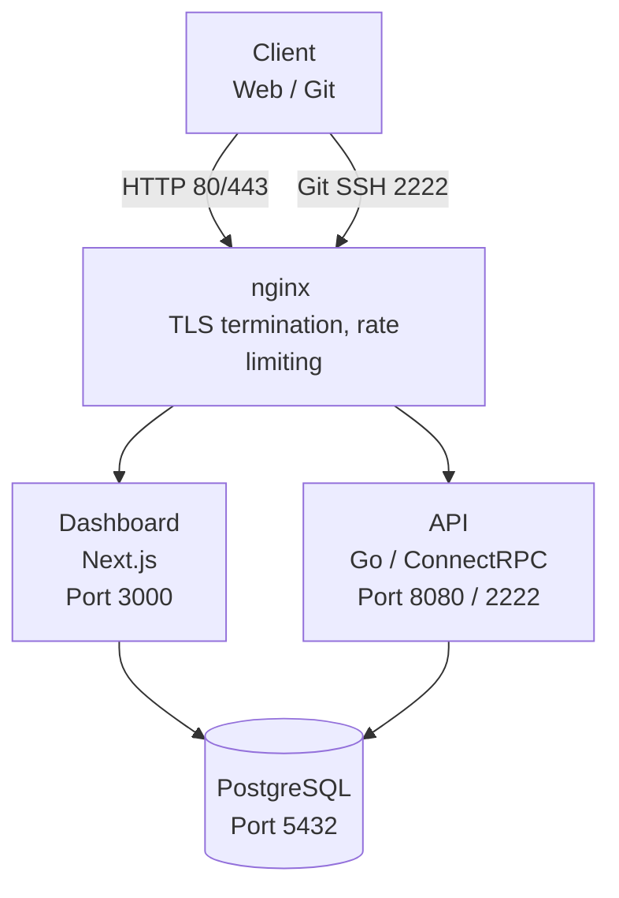

<div align="center">


# Hasir

**Self-hosted schema registry with Git-native workflows, automatic SDK generation, and a management dashboard.**

[](https://go.dev)
[](https://nextjs.org)
[](https://buf.build)
[](https://docs.docker.com/compose/)
[](https://codecov.io/gh/lynicis/hasir)

</div>

---

## What is Hasir?

Hasir is a self-hosted platform for managing protobuf schemas. Push schemas over Git SSH, and Hasir automatically generates typed client SDKs from your definitions. A built-in dashboard lets you manage organizations, repositories, users, and SSH keys.

> [!NOTE]
> The original standalone repositories (`api`, `dashboard`, `proto`, `docker-images`) under the [protohasir](https://github.com/protohasir) organization are retired. They remain available for older versions, but all active development continues here.

## Features

- **Schema Registry** — Version-controlled protobuf schema storage with Git-native push/pull
- **Git-over-SSH** — Built-in SSH server for Git workflows, no external Git host required
- **Automatic SDK Generation** — Generates typed client SDKs from Buf modules with configurable worker pools
- **Management Dashboard** — Web UI for organizations, repositories, members, and SSH key management
- **ConnectRPC API** — Type-safe RPC API compatible with gRPC, gRPC-Web, and Connect protocols
- **OpenTelemetry** — Distributed tracing and structured logging built in
- **TLS out of the box** — Automated Let's Encrypt certificates via Certbot

## Architecture



---

## Deployment

### Docker Compose (single server)

Requires a Linux server with Docker, a domain name pointing to it, and ports `80`, `443`, `2222` open.

```bash
# Clone and enter the deployment directory
git clone https://github.com/lynicis/hasir.git
cd hasir/docker

# Run setup — installs Docker, configures firewall, bootstraps TLS
sudo ./scripts/setup.sh

# Configure environment
cp .env.example .env
nano .env    # Set DOMAIN, LETSENCRYPT_EMAIL, SMTP credentials

# Deploy — pulls images, starts services, requests Let's Encrypt certificate
sudo ./scripts/deploy.sh
```

The dashboard is available at `https://your-domain.com` and Git SSH at port `2222`.

#### Environment Variables

| Variable             | Description                                    | Required |
| -------------------- | ---------------------------------------------- | -------- |
| `DOMAIN`             | Domain where Hasir is hosted                   | Yes      |
| `LETSENCRYPT_EMAIL`  | Email for Let's Encrypt notifications          | Yes      |
| `POSTGRES_USER`      | PostgreSQL username                            | Yes      |
| `POSTGRES_PASSWORD`  | PostgreSQL password                            | Yes      |
| `POSTGRES_DB`        | PostgreSQL database name                       | Yes      |
| `JWT_SECRET`         | Secret for signing JWT tokens                  | Yes      |
| `SMTP_HOST`          | SMTP server hostname                           | Yes      |
| `SMTP_PORT`          | SMTP server port                               | Yes      |
| `SMTP_USERNAME`      | SMTP authentication username                   | Yes      |
| `SMTP_PASSWORD`      | SMTP authentication password                   | Yes      |
| `SMTP_FROM`          | Sender address for outgoing emails             | Yes      |
| `SMTP_USE_TLS`       | Enable TLS for SMTP (`true`/`false`)           | Yes      |
| `API_TAG`            | API Docker image tag (default: `latest`)       | No       |
| `DASHBOARD_TAG`      | Dashboard Docker image tag (default: `latest`) | No       |

### Kubernetes (Helm)

```bash
helm dependency update deploy/helm/hasir
helm install hasir deploy/helm/hasir -f deploy/helm/hasir/values.yaml
```

See [`deploy/helm/`](deploy/helm/) for chart values and templates.

---

## Usage

### Connecting via Git SSH

Add your SSH public key through the dashboard, then push schemas:

```bash
# Clone a schema repository
git clone ssh://git@your-domain.com:2222/org/repo.git

# Push schema changes
git add .
git commit -m "add user service definition"
git push origin main
```

Hasir picks up the push and generates SDKs automatically based on the repository's Buf configuration.

---

## Backup & Restore

```bash
# Create a database backup
sudo ./scripts/backup.sh

# Automate daily backups via cron (runs at 2:00 AM)
sudo crontab -e
# 0 2 * * * /path/to/hasir/docker/scripts/backup.sh >> /var/log/hasir-backup.log 2>&1

# Restore from backup
gunzip -c backups/hasir_db_YYYYMMDD_HHMMSS.sql.gz | \
  docker compose exec -T postgres psql -U hasir -d hasir
```

---

## Development

For contributors working on Hasir itself.

### Prerequisites

| Tool | Version |
| ---- | ------- |
| [Bun](https://bun.sh) | >= 1.3.14 |
| [Go](https://go.dev) | >= 1.26 |
| [Node.js](https://nodejs.org) | >= 22 |
| [Buf](https://buf.build/docs/installation) | Latest |

### Setup

```bash
make setup

cp apps/api/config.example.json apps/api/config.json
cp apps/dashboard/.env.example apps/dashboard/.env.local

make dev
```

The API runs at `http://localhost:8080` and the dashboard at `http://localhost:3000`.

### Commands

| Command          | Description                                      |
| ---------------- | ------------------------------------------------ |
| `make setup`     | Install deps, generate proto, update Helm charts |
| `make dev`       | Start API + dashboard via Turborepo              |
| `make build`     | Build all affected workspaces                    |
| `make test`      | Run tests across affected workspaces             |
| `make lint`      | ESLint + golangci-lint across the monorepo       |
| `make typecheck` | TypeScript type checking                         |
| `make proto`     | Regenerate code from `.proto` definitions        |
| `make docker`    | Build all Docker images (Buildx Bake)            |
| `make helm-lint` | Lint and validate Helm charts                    |
| `make clean`     | Remove build artifacts and caches                |
| `make release`   | Tag and release a service (`app=api bump=patch`) |

### Project Structure

```
apps/api/            Go API service (ConnectRPC, PostgreSQL, JWT, SSH)
apps/dashboard/      Next.js dashboard (React, shadcn/ui, Tailwind)
proto/               Protocol buffer definitions (Buf)
packages/            Shared configs (eslint, tsconfig, UI components)
deploy/helm/         Helm chart for Kubernetes deployment
docker/              Docker Compose stack (nginx, certbot)
scripts/             Build, release, and lint utilities
docs/                Architecture docs and ADRs
```

## Documentation

| Document | Description |
| -------- | ----------- |
| [Architecture](docs/ARCHITECTURE.md) | System design and component boundaries |
| [Migration Guide](docs/MIGRATION.md) | Database and breaking-change migrations |
| [Release Strategy](docs/RELEASE.md) | Versioning, tagging, and release workflow |
| [ADRs](docs/adr/) | Architecture Decision Records |
| [Docker Stack](docker/README.md) | Full deployment and operations guide |
